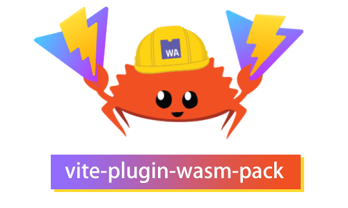

<p align="center">
  
</p>

<h1 align="center">
  
🦀 Vite plugin for rust [wasm-pack](https://github.com/rustwasm/wasm-pack), it's simple.
  
</h1>

<h4 align="center">
  
[](https://www.npmjs.com/package/vite-plugin-wasm-pack)
[](https://www.npmjs.com/package/vite-plugin-wasm-pack)
[](https://www.npmjs.com/package/vite-plugin-wasm-pack)
  
</h4>

## Quick start

Make sure [wasm-pack](https://github.com/rustwasm/wasm-pack) installed correctly.

Clone this repo or download the [zip file](https://github.com/nshen/vite-plugin-wasm-pack/archive/refs/heads/main.zip), extract the example folder.

```
example
  |
  |-- my-crate       # rust project folder, there is a Cargo.toml in it
  |-- src            # front end source code
  |   |-- index.ts   # entry point
  |-- index.html     # html entry
  |-- vite.config.ts # vite config file
  |__ package.json   # npm config file
```

Install npm develop dependencies, **in example folder** run:

```bash
yarn install
# or
# npm install
```

After that you can build `rust project` to `WebAassembly` by using `wasm-pack`.

```bash
wasm-pack build ./my-crate --target web
```

Now the `my-crate` module is ready, start vite dev server.

```bash
yarn dev
or
#npm run dev
```

Done, if below is showing.

```bash
  vite v2.6.5 dev server running at:

  > Local: http://localhost:3000/

  ready in 169ms.
```

---

## Install manually

```bash
yarn add vite vite-plugin-wasm-pack -D
# or
# npm i vite vite-plugin-wasm-pack vite -D
```

## Usage

Add this plugin to `vite.config.ts`

```js
import { defineConfig } from 'vite';
import wasmPack from 'vite-plugin-wasm-pack';

export default defineConfig({
  // pass your local crate path to the plugin
  plugins: [wasmPack('./my-crate')]
});
```

Add script to `package.json`

```json
"scripts": {
  "dev": "vite",
  "build": "vite build"
}
```

⚠ **Don't forget to build your [wasm-pack](https://github.com/rustwasm/wasm-pack) crate first!**

```bash
wasm-pack build ./my-crate --target web
```

Tips: you can add a `wasm` script to `package.json` like this:

```json
"scripts": {
    "wasm": "wasm-pack build ./my-crate --target web",
    "dev": "yarn wasm && vite",
    "build": "vite build"
}
```

Then, run:

```bash
yarn dev
```

This will start dev server, and install `my-crate` that you built earlier.

## Use wasm-pack package installed via npm

If you want use a package from npm that built with wasm-pack, like this one [test-npm-crate](https://www.npmjs.com/package/test-npm-crate)

you have to pass the package name to the second param of our plugin.

`wasmPack(['./my-local-crate'],['test-npm-crate'])`

full example is in [./npm-crate-example](./npm-crate-example) folder.

## Examples

- Quick starter is in [./example](./example) folder.
- Game of life [[source]](https://github.com/nshen/vite-wasm-game-of-life) [[demo]](http://github.nshen.net/vite-wasm-game-of-life/dist/)

## License

MIT, see [the license file](./LICENSE)
